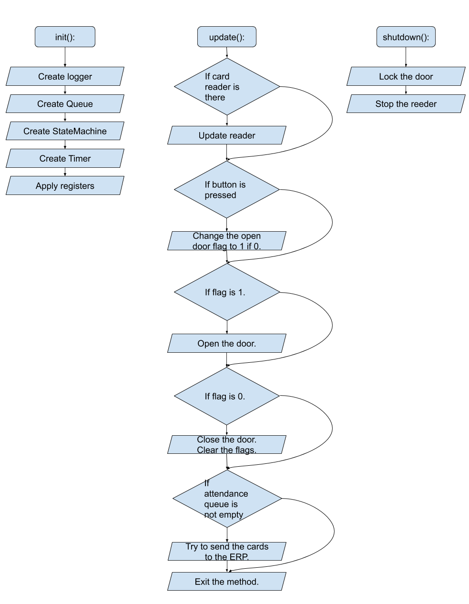

# Access Control System

## Description

This article is dedicated to describe functional behavior of the Access Control System. We will call it for short the AC.

AC it self represents automated way to identify a given person who would like to access a given door. It is simple the person should have a way method to identify to the system, so we provide two ways - RFID and NFC. The door controller should be aware which person is allowed or not. This is made by exchanging information about which card is allowed to access the given door. The exchange is made on demand so the access list is always up to date.

The logic after inserting the card to the card reader is simple. If the card is in the access list, signal is given to the lock mechanism to unlock the door. After a short specified time the door is locked again.

It is important to notice that the door locking mechanism is corresponding to all fire security requirements. In case of fire all necessary actions war taken.

## Diagram of work

This diagram simplify graphically the way of how this particular plugin works.

At the diagram is shown 3 class methods of tha class AccessControl(BasePlugin):
 - init(self): - This method is responsible for initialization of the plugin.
 - update(self): - This method is called periodically and gives part time runtime for the plugin.
 - shutdown(self): - This methods clear all allocated memory if necessary and prepare all components for deletion.